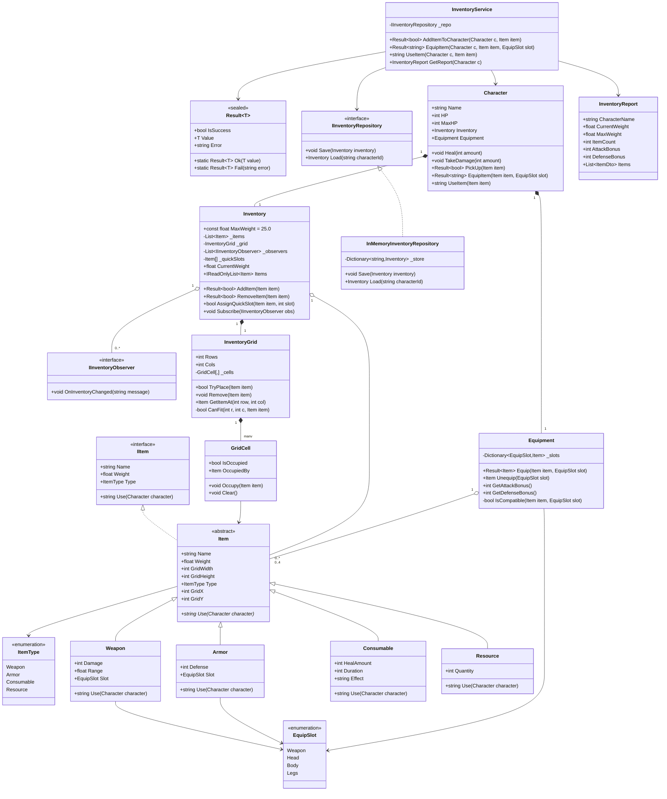

# Діаграма класів — InventoryRPG

```mermaid
classDiagram

    %% ── ENUMS ──────────────────────────────────────────
    class ItemType {
        <<enumeration>>
        Weapon
        Armor
        Consumable
        Resource
    }

    class EquipSlot {
        <<enumeration>>
        Weapon
        Head
        Body
        Legs
    }

    %% ── РЕЗУЛЬТАТ ОПЕРАЦІЇ ──────────────────────────────
    class Result~T~ {
        <<sealed>>
        +bool IsSuccess
        +T Value
        +string Error
        +static Result~T~ Ok(T value)
        +static Result~T~ Fail(string error)
    }

    %% ── ІНТЕРФЕЙСИ ──────────────────────────────────────
    class IItem {
        <<interface>>
        +string Name
        +float Weight
        +ItemType Type
        +string Use(Character character)
    }

    class IInventoryRepository {
        <<interface>>
        +void Save(Inventory inventory)
        +Inventory Load(string characterId)
    }

    class IInventoryObserver {
        <<interface>>
        +void OnInventoryChanged(string message)
    }

    %% ── DOMAIN: ПРЕДМЕТИ ────────────────────────────────
    class Item {
        <<abstract>>
        +string Name
        +float Weight
        +int GridWidth
        +int GridHeight
        +ItemType Type
        +int GridX
        +int GridY
        +string Use(Character character)*
    }

    class Weapon {
        +int Damage
        +float Range
        +EquipSlot Slot
        +string Use(Character character)
    }

    class Armor {
        +int Defense
        +EquipSlot Slot
        +string Use(Character character)
    }

    class Consumable {
        +int HealAmount
        +int Duration
        +string Effect
        +string Use(Character character)
    }

    class Resource {
        +int Quantity
        +string Use(Character character)
    }

    %% ── DOMAIN: СІТКА ───────────────────────────────────
    class GridCell {
        +bool IsOccupied
        +Item OccupiedBy
        +void Occupy(Item item)
        +void Clear()
    }

    class InventoryGrid {
        +int Rows
        +int Cols
        -GridCell[,] _cells
        +bool TryPlace(Item item)
        +void Remove(Item item)
        +Item GetItemAt(int row, int col)
        -bool CanFit(int r, int c, Item item)
    }

    %% ── DOMAIN: ІНВЕНТАР ────────────────────────────────
    class Inventory {
        +const float MaxWeight = 25.0
        -List~Item~ _items
        -InventoryGrid _grid
        -List~IInventoryObserver~ _observers
        -Item[] _quickSlots
        +float CurrentWeight
        +IReadOnlyList~Item~ Items
        +Result~bool~ AddItem(Item item)
        +Result~bool~ RemoveItem(Item item)
        +bool AssignQuickSlot(Item item, int slot)
        +void Subscribe(IInventoryObserver obs)
    }

    %% ── DOMAIN: СПОРЯДЖЕННЯ ─────────────────────────────
    class Equipment {
        -Dictionary~EquipSlot,Item~ _slots
        +Result~Item~ Equip(Item item, EquipSlot slot)
        +Item Unequip(EquipSlot slot)
        +int GetAttackBonus()
        +int GetDefenseBonus()
        -bool IsCompatible(Item item, EquipSlot slot)
    }

    %% ── DOMAIN: ПЕРСОНАЖ ────────────────────────────────
    class Character {
        +string Name
        +int HP
        +int MaxHP
        +Inventory Inventory
        +Equipment Equipment
        +void Heal(int amount)
        +void TakeDamage(int amount)
        +Result~bool~ PickUp(Item item)
        +Result~string~ EquipItem(Item item, EquipSlot slot)
        +string UseItem(Item item)
    }

    %% ── APPLICATION: СЕРВІС ─────────────────────────────
    class InventoryService {
        -IInventoryRepository _repo
        +Result~bool~ AddItemToCharacter(Character c, Item item)
        +Result~string~ EquipItem(Character c, Item item, EquipSlot slot)
        +string UseItem(Character c, Item item)
        +InventoryReport GetReport(Character c)
    }

    class InventoryReport {
        +string CharacterName
        +float CurrentWeight
        +float MaxWeight
        +int ItemCount
        +int AttackBonus
        +int DefenseBonus
        +List~ItemDto~ Items
    }

    %% ── INFRASTRUCTURE ──────────────────────────────────
    class InMemoryInventoryRepository {
        -Dictionary~string,Inventory~ _store
        +void Save(Inventory inventory)
        +Inventory Load(string characterId)
    }

    %% ── ЗВВЯЗКИ ─────────────────────────────────────────

    IItem <|.. Item
    Item <|-- Weapon
    Item <|-- Armor
    Item <|-- Consumable
    Item <|-- Resource

    Item --> ItemType
    Weapon --> EquipSlot
    Armor --> EquipSlot
    Equipment --> EquipSlot

    InventoryGrid "1" *-- "many" GridCell
    GridCell --> Item

    Inventory "1" *-- "1" InventoryGrid
    Inventory "1" o-- "0..*" Item
    Inventory "1" o-- "0..*" IInventoryObserver

    Character "1" *-- "1" Inventory
    Character "1" *-- "1" Equipment
    Equipment "1" o-- "0..4" Item

    InventoryService --> Character
    InventoryService --> IInventoryRepository
    InventoryService --> Result~bool~
    InventoryService --> InventoryReport

    IInventoryRepository <|.. InMemoryInventoryRepository
```
