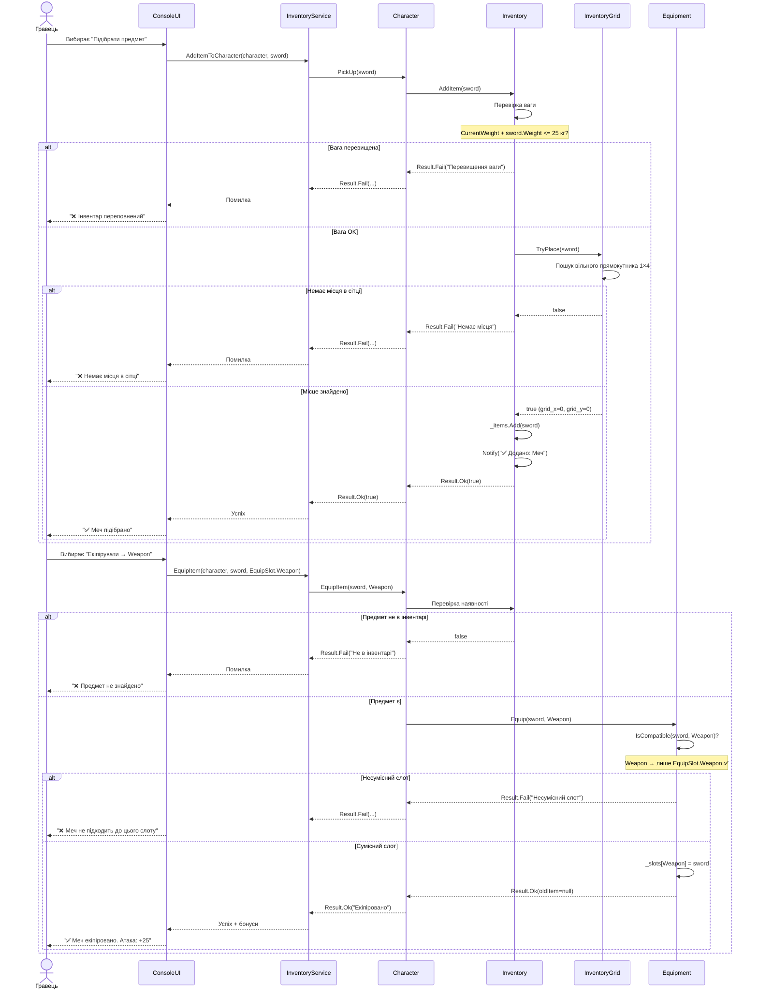

# Діаграма послідовності — Сценарій: Підібрати та екіпірувати предмет

```mermaid
sequenceDiagram
    actor Player as Гравець
    participant Console as ConsoleUI
    participant Service as InventoryService
    participant Character as Character
    participant Inventory as Inventory
    participant Grid as InventoryGrid
    participant Equipment as Equipment

    Player->>Console: Вибирає "Підібрати предмет"
    Console->>Service: AddItemToCharacter(character, sword)

    Service->>Character: PickUp(sword)
    Character->>Inventory: AddItem(sword)

    Inventory->>Inventory: Перевірка ваги
    Note over Inventory: CurrentWeight + sword.Weight <= 25 кг?

    alt Вага перевищена
        Inventory-->>Character: Result.Fail("Перевищення ваги")
        Character-->>Service: Result.Fail(...)
        Service-->>Console: Помилка
        Console-->>Player: "❌ Інвентар переповнений"
    else Вага OK
        Inventory->>Grid: TryPlace(sword)
        Grid->>Grid: Пошук вільного прямокутника 1×4

        alt Немає місця в сітці
            Grid-->>Inventory: false
            Inventory-->>Character: Result.Fail("Немає місця")
            Character-->>Service: Result.Fail(...)
            Service-->>Console: Помилка
            Console-->>Player: "❌ Немає місця в сітці"
        else Місце знайдено
            Grid-->>Inventory: true (grid_x=0, grid_y=0)
            Inventory->>Inventory: _items.Add(sword)
            Inventory->>Inventory: Notify("✅ Додано: Меч")
            Inventory-->>Character: Result.Ok(true)
            Character-->>Service: Result.Ok(true)
            Service-->>Console: Успіх
            Console-->>Player: "✅ Меч підібрано"
        end
    end

    Player->>Console: Вибирає "Екіпірувати → Weapon"
    Console->>Service: EquipItem(character, sword, EquipSlot.Weapon)

    Service->>Character: EquipItem(sword, Weapon)
    Character->>Inventory: Перевірка наявності

    alt Предмет не в інвентарі
        Inventory-->>Character: false
        Character-->>Service: Result.Fail("Не в інвентарі")
        Service-->>Console: Помилка
        Console-->>Player: "❌ Предмет не знайдено"
    else Предмет є
        Character->>Equipment: Equip(sword, Weapon)
        Equipment->>Equipment: IsCompatible(sword, Weapon)?
        Note over Equipment: Weapon → лише EquipSlot.Weapon ✅

        alt Несумісний слот
            Equipment-->>Character: Result.Fail("Несумісний слот")
            Character-->>Service: Result.Fail(...)
            Console-->>Player: "❌ Меч не підходить до цього слоту"
        else Сумісний слот
            Equipment->>Equipment: _slots[Weapon] = sword
            Equipment-->>Character: Result.Ok(oldItem=null)
            Character-->>Service: Result.Ok("Екіпіровано")
            Service-->>Console: Успіх + бонуси
            Console-->>Player: "✅ Меч екіпіровано. Атака: +25"
        end
    end
```
